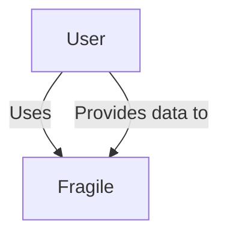

# The Fragile Architectural by Lxudrr

  

## Contents

  

- [Welcome](#welcome)

- [About the Fragile](#about-the-fragile)

- [Business Case](#business-case)

- [Current Scenario](#current-scenario)

- [Business Drivers](#business-drivers)

- [Business Goals](#business-goals)

- [System Requirements](#system-requirements)

- [Stakeholders](#stakeholders)

- [Functional Requirements](#functional-requirements)

- [Architecture Characteristics Requirements](#architecture-characteristics-requirements)

- [Constraints](#constraints)

- [Assumptions](#assumptions)

- [Baseline Architecture](#baseline-architecture)

- [System Context](#system-context)

- [Containers](#containers)

- [Dynamic View](#dynamic-view)

- [Target Architecture](#target-architecture)

- [Use Case Model](#use-case-model)

- [System Context](#system-context)

- [Containers](#containers)

- [Process Views](#process-views)

- [Customer Registration](#customer-registration)

- [Ticket Submission](#ticket-submission)

- [Ticket Assignment](#ticket-assignment)

- [Ticket Acceptance](#ticket-acceptance)

- [Ticket In-progress](#ticket-in-progress)

- [Ticket Completion](#ticket-completion)

- [Ticket Resolved](#ticket-resolved)

- [Survey Submission](#survey-submission)

- [Monthly Billing](#monthly-billing)

- [Deployment](#deployment)

- [Transition Architecture](#transition-architecture)

- [Risk Analysis](#risk-analysis)

- [Performance](#performance)

- [Availability](#availability)

- [Security](#security)

- [Other](#other)

  

## Welcome

  

Welcome to the Fragile Architectural by Lxudrr, 06.December.23

  

### About the Fragile

  
Fragile - is a service that gives You an opportunity to connect the most popular services You use in order to collect every important part of Your games/animes/social-blogs in one place. We offers a plenty of different services that are already can be connected. Of course it is not the end. We will Move ON.

## Business Case

  

Everyone of us has seen so many similar services, but the main difference between them and us is that our primary aim is to gather all known services, not like others make only animes or games. Monetization - *buy me a coffe* ;)

  

### Current Scenario

  

We need to create a powerful functional service that will allow users to have a friendly and easy-to-use experience.

  

### Business Drivers

  

- **Team:** Development of a team skills.

- **Growing User Base:** Satisfying market needs.

- **Technologies:** Improvement of technological processes.

  

### Business Goals

  

Develop an app for sharing ranks and reviews among friends.

  
  
## System Requirements

  

### Stakeholders

  

This section outlines key stakeholders involved in the system and their primary architectural concerns.

  

* **SH-1**: **Customer**

- A person who gets on the website to look up friend's info.

  

* **SH-2**: **User**

- A person who already has connected at least one third-part service.

  

* **SH-3**: **Team**

- A team should develop website and help users with their issues.

  
  
### Functional Requirements

  

* **UC-1**: **Customer**:

- Customer looks up friend's info.

* **UC-2**: **Customer**:

- Customer registers account.

* **UC-3**: **User**:

- User connects more third-part services.

- **UC-4**: **User**:

- User creates image with the main static on his profile (Example: Spotify with link on self allows us to share image in social medias, so everyone can see main info about your preferences)

- **UC-5**: **Team**:

- Team should fix bugs and answer on reports. 

  

### Architecture Characteristics Requirements

  

* **QA-1**: **Scalability**

- The system should scale to handle an increasing number of users and their aggregated ratings.

  

* **QA-2**: **Availability**

- High availability is crucial to ensure users can access and explore the platform without disruptions.

  

* **QA-3**: **Performance**

- Secure storage and handling of user data, ensuring compliance with industry standards for data protection.

  

### Constraints

  

### Assumptions

  

* **ASM-1**: **API Integration**

- Fragile will integrate with external APIs from services like Shikimori, MyAnimeList, Netflix, IMDB, etc., to fetch and aggregate user ratings.

## Tech Stack

  

- **Backend Programming Language**: Python

- **Frontend Programming Language**: JavaScript

- **Backend Deployment**: Docker (Monolith)

- **Infrastructure Options**: AWS, Microsoft Azure, Digital Ocean, Google Cloud Platform

- **Database**: PostgreSQL

## Baseline Architecture

  

This section describes the architecture of the current Fragile platform.

  

### System Context

  

  

### Containers

 

### Dynamic View

## Target Architecture

  

### Use Case

### System Context

  

### Containers
  

### Process Views

#### UC-3: Ticket acceptance

  
#### UC-3: Ticket completion

  

#### UC-3: Ticket Resolved

  

#### UC-4: Survey Submission

  

#### UC-7: Monthly billing

  

### Deployment

  

## Transition Architecture

  

### Risk Analysis

  

#### Performance

  

#### Availability

  

#### Security

#### Other
