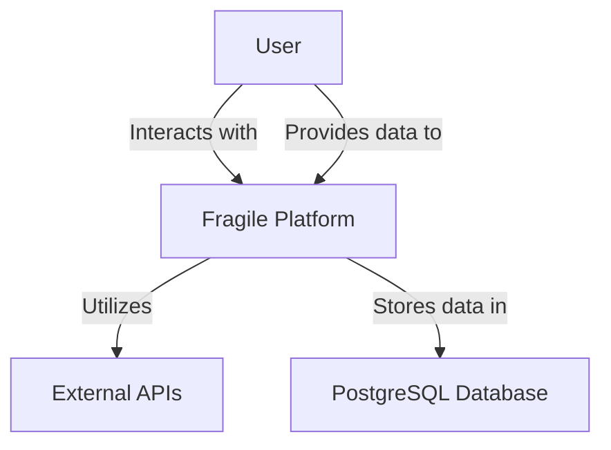
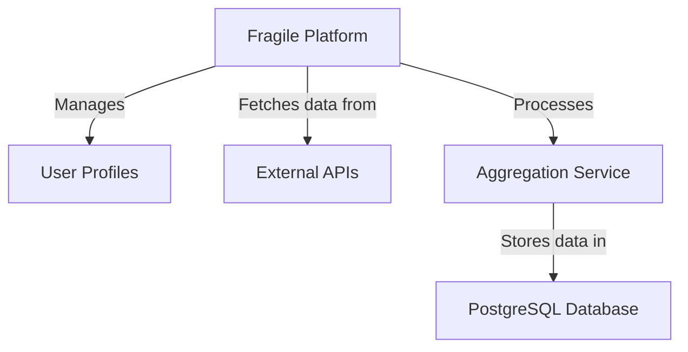
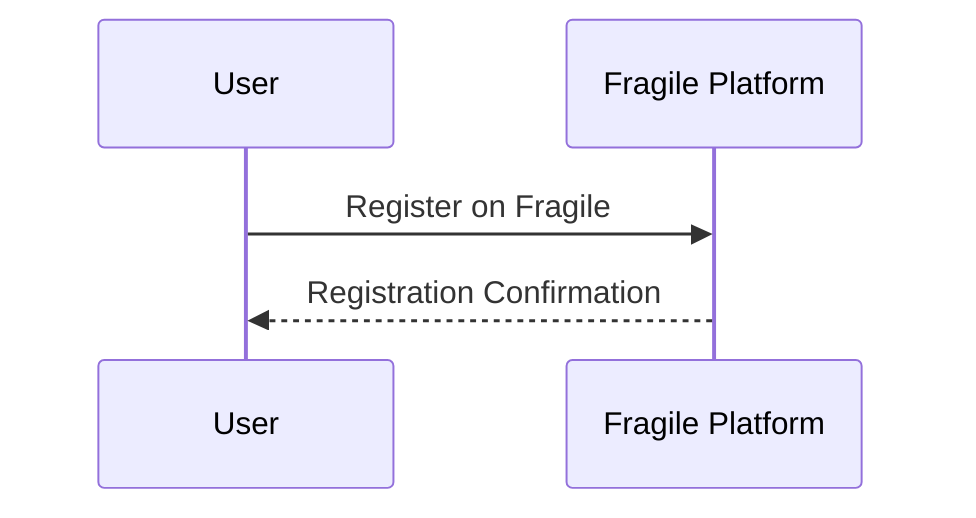
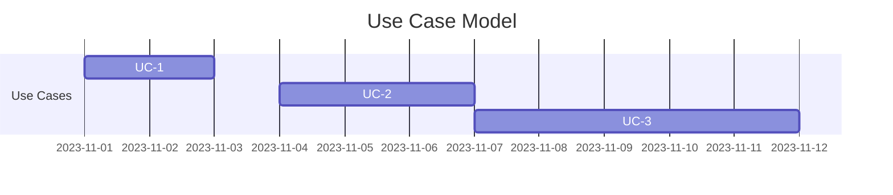
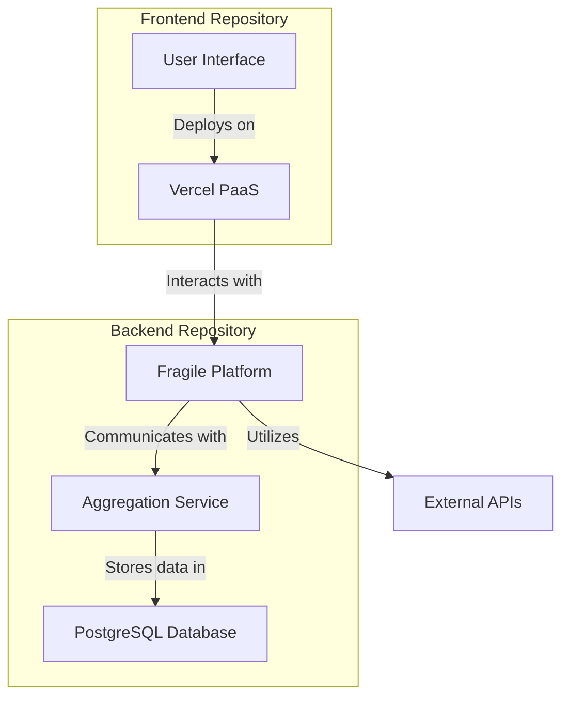
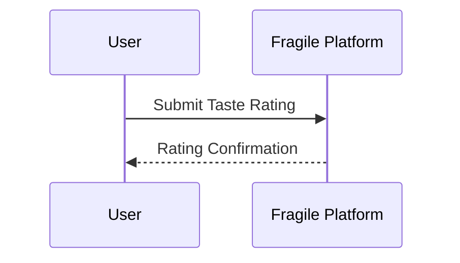
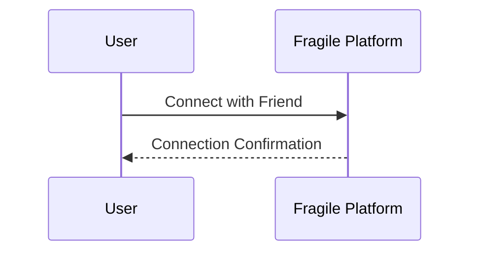
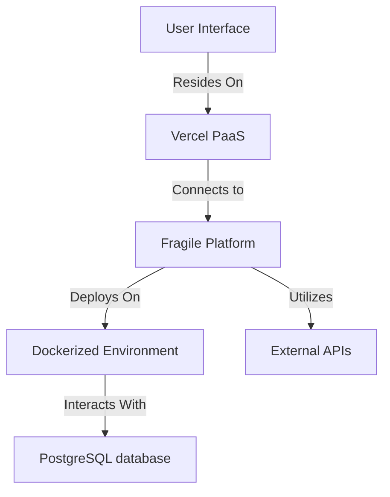
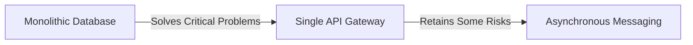

# Fragile - Friend's Ratings Aggregator I Love Endless

This document is a type of architectural documentation or architectural kata. It outlines the high-level system overview, including the business case, system requirements, tech stack, baseline architecture, target architecture, and transition architecture. This type of documentation is crucial in understanding the structure, components, and goals of a software system from an architectural perspective. It helps stakeholders, including developers, project managers, and other relevant parties, grasp the essential aspects of the system's design and functionality.

## Contents

- [Welcome](#welcome)
    - [About Fragile](#about-fragile)
- [Business Case](#business-case)
    - [Current Scenario](#current-scenario)
    - [Business Drivers](#business-drivers)
    - [Business Goals](#business-goals)
- [System Requirements](#system-requirements)
    - [Stakeholders](#stakeholders)
    - [Functional Requirements](#functional-requirements)
    - [Architecture Characteristics Requirements](#architecture-characteristics-requirements)
    - [Constraints](#constraints)
    - [Assumptions](#assumptions)
- [Tech Stack](#tech-stack)
- [Baseline Architecture](#baseline-architecture)
    - [System Context](#system-context)
    - [Containers](#containers)
    - [Dynamic View](#dynamic-view)
- [Target Architecture](#target-architecture)  
    - [Use Case Model](#use-case-model)  
    - [System Context](#system-context)  
    - [Containers](#containers)  
    - [Process Views](#process-views)
        - [User Registration](#user-registration)
        - [Taste Rating Submission](#taste-rating-submission)
        - [Friend Connection](#friend-connection)
    - [Deployment](#deployment)
- [Transition Architecture](#transition-architecture)
    - [Risk Analysis](#risk-analysis)
        - [Performance](#performance)
        - [Other](#other)

## Welcome

Welcome to the Fragile Architectural Kata by kenjitheman, October 29, 2023.

### About Fragile

Fragile is not just an app; it's a digital companion that aggregates the tastes and preferences of your friends. Fragile is where the threads of diverse likes and dislikes weave together to guide you towards discovering content that resonates with your social circle.

## Business Case

In the landscape of content consumption, Fragile seeks to stand out as the go-to platform for tastes aggregator based on the tastes of your friends. The current scenario involves scattered ratings across various platforms, making it challenging to get a comprehensive view of your preferences and those of your friends. Fragile aims to address this by providing a unified space where you can aggregate and explore the friend's taste landscape.

### Current Scenario

Currently, users rely on multiple platforms such as Shikimoru, MyAnimeList, Netflix, IMDB, and others to rate and keep track of their favorite content. The challenge lies in the fragmentation of these ratings, making it cumbersome to get a holistic understanding of individual and collective preferences.

### Business Drivers

- **Unified Ratings:** Users want a centralized platform to aggregate their ratings from various services.
- **Simplified Exploration:** Streamlining the process of discovering content based on the current preferences of the user and their friends.

### Business Goals

Fragile is dedicated to simplifying the content discovery experience for users and achieving the following goals:

- **Unified Ratings Hub:** Platform where users can aggregate ratings from different services into a single view.
- **Intuitive User Experience:** Intuitive and user-friendly interface for seamless exploration of aggregated ratings and recommendations.

## System Requirements

### Stakeholders

This section outlines key stakeholders involved in the system and their primary architectural concerns.

- **SH-1**: **User** (usability, performance, availability)
    - Users are concerned with the usability and performance of the Fragile platform for seamless content discovery.
- **SH-2**: **Developer** (maintainability, extensibility)
    - Developers aim for a maintainable and extensible codebase, allowing for future enhancements and updates.

### Functional Requirements

- **UC-1**: **User Registration**:
    - Users can register on the Fragile platform to create an account.

- **UC-2**: **Taste Rating Submission**:
    - Users can submit taste ratings for content from various integrated services.

- **UC-3**: **Friend Connection**:
    - Users can connect with friends on the platform to access their aggregated ratings.

### Architecture Characteristics Requirements

- **QA-1**: **Scalability** (UC-1)
    - The system should scale to handle an increasing number of users and their aggregated ratings.

- **QA-2**: **Availability** (UC-1)
    - High availability is crucial to ensure users can access and explore the platform without disruptions.

- **QA-3**: **Security** (UC-1, UC-2)
    - Secure storage and handling of user data, ensuring compliance with industry standards for data protection.

### Constraints

- **CON-1**: **Technology Infrastructure**
    - Selection between cloud-based (AWS, Heroku, etc.) or on-premises infrastructure for hosting the Fragile platform.
    - Determination of the technology stack for development and integration with various APIs.

### Assumptions

- **ASM-1**: **API Integration**
    - Fragile will integrate with external APIs from services like Shikimori, MyAnimeList, Netflix, IMDB, etc., to fetch and aggregate user ratings.
- **ASM-2**: **Monolithic Backend**
    - The initial architecture will be a monolith with separate repositories for the frontend and backend.
- **ASM-3**: **Dockerized Deployment**
    - The backend will be deployed as a monolith in Docker containers for easy management and scalability.
- **ASM-4**: **Database Selection**
    - PostgreSQL will be used as the database for storing user data and aggregated ratings, also deployed in Docker container.

## Tech Stack

- **Backend Programming Language**: Python
- **Frontend Programming Language**: JavaScript
    - **Frontend Hosting**: Vercel (PaaS)
- **Backend Deployment**: Docker (Monolith)
    - **Infrastructure Options**: AWS, Heroku, Local, Linode, Digital Ocean
- **Database**: PostgreSQL

## Baseline Architecture

This section describes the architecture of the current Fragile platform.

### System Context

### Containers

### Dynamic View

## Target Architecture

This section describes the target software architecture for Fragile.

### Use Case Model

### System Context

### Containers

### Process Views

This section explains some key use cases to demonstrate how corresponding workflows pass through containers.

#### User Registration

#### Taste Rating Submission

#### Friend Connection

### Deployment

The deployment diagram illustrates how the system containers are mapped to the infrastructure.

## Transition Architecture

The proposed solution in the Target Architecture serves as the ultimate solution to address most problems and risks. However, it may require substantial development efforts due to the necessary database split. Therefore, the approach is divided into two phases:

- Address critical issues and continue with a monolithic database until it creates a bottleneck.
- Transition further towards the target architecture to resolve remaining risks.

Given the single monolithic database, reduced efforts are required for additional messaging and replication.

### Risk Analysis

The transitional architecture presents several potential high risks.

### Performance

The monolithic database may pose a performance bottleneck, similar to the concern around the single API Gateway, potentially becoming a bottleneck if not scaled appropriately.
Availability

A single API Gateway might introduce a single point of failure for the entire system.

### Other

Additional concerns regarding the API Gateway:

- Adds coupling between the gateway and the internal service.
- If developed by a single development team, may become a development bottleneck.
